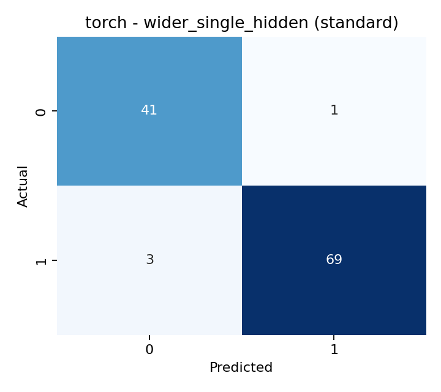
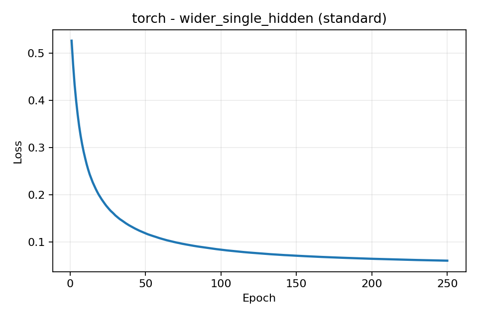

# YZM304 Derin Öğrenme Proje Ödevi

Bu depo, Ankara Üniversitesi YZM304 Derin Öğrenme dersi birinci proje ödevi için hazırlanmış, sıfırdan kurulabilir ve tekrar üretilebilir bir deney çalışmasıdır. Proje; veri ön işleme, manuel NumPy MLP, `scikit-learn` MLPClassifier, PyTorch MLP, confusion matrix, temel sınıflandırma metrikleri, overfitting/underfitting yorumu ve IMRAD raporlamasını tek bir akış içinde sunar.


## Hızlı Başlangıç

### Sıfır bilgisayarda kurulum

1. Python 3.12 veya üzeri kurulu olmalı.
2. Proje klasörüne gelin.
3. PowerShell üzerinden aşağıdaki komutları çalıştırın:

```powershell
powershell -ExecutionPolicy Bypass -File .\scripts\setup_env.ps1
powershell -ExecutionPolicy Bypass -File .\scripts\run_pipeline.ps1
powershell -ExecutionPolicy Bypass -File .\scripts\run_checks.ps1
```

### Elle kurulum

```powershell
python -m pip install --upgrade pip
python -m pip install -e ".[dev]"
python .\run_project.py --output-dir artifacts\manual-run
python -m pytest
python -m ruff check .
```

### Üretilen çıktılar

Çalışma sonunda belirtilen klasörde şu dosyalar oluşur:

- `summary.json`
- `eda_summary.json`
- `model_comparison.csv`
- her model için bir `confusion_matrix_*.png`
- her model için bir `learning_curve_*.png`

Varsayılan PowerShell akışı çıktıları `artifacts/latest/` altına yazar. Bu depoda tam deney koşusu `artifacts/final/` altında da üretilmiştir.

## 1. Introduction

Bu çalışmanın temel amacı, derste ve laboratuvarda üzerinde durduğumuz basit iki katmanlı (tek gizli katmanlı) yapay sinir ağı mimarisini alarak çok daha genişletilmiş, yapısal bir projeye dönüştürmektir. Çalışmada ikili sınıflandırma problemi olarak scikit-learn kütüphanesindeki `breast_cancer` veri seti ele alınmış ve çeşitli ön işleme aşamalarından geçirilmiştir. Uygulama süresince sinir ağının düğüm sayıları (16, 32, 64), katman derinlikleri, mini-batch boyutları ve regülarizasyon değerleri değiştirilerek varyans/bias durumları ile olası overfitting/underfitting problemleri incelenmiş, eğitim/test ve validation setleri ile performansları kanıtlanmıştır.

Veri seti olarak `scikit-learn` bünyesindeki gömülü kanser verisi tercih edildiği için, projenin tamamen çevrimdışı ve herhangi bir ekstra indirme işlemi gerektirmeden tekrar çalıştırılıp test edilebilmesi sağlanmıştır. Performans değerlendirmesinde şeffaflık sağlamak adına sadece NumPy ile sıfırdan implement edilen kendi MLP yapımızla yetinilmemiş, Scikit-learn ve PyTorch kütüphanelerindeki referans implementasyonlar da projeye dahil edilmiştir.

## 2. Methods

### 2.1 Ortam ve tekrar üretilebilirlik

- Python sürümü: `3.13.12`
- Izole ortam: aktif Python ortami
- Paket tanımı: `pyproject.toml`
- Çalışan sürüm kilidi: `requirements-lock.txt`
- Ana giriş noktası: `run_project.py`
- Test komutu: `python -m pytest`
- Statik kontrol komutu: `python -m ruff check .`

Tüm modellerde sabit tohumlar kullanıldı. Kütüphaneler arası karşılaştırmayı adil hâle getirmek için:

- aynı train/validation/test bölünmesi kullanıldı,
- aynı mimariler tanımlandı,
- ağırlıklar ortak bir başlangıç üreticisinden oluşturuldu,
- optimizasyon `SGD` ile yapıldı,
- tüm modeller full-batch eğitim ile çalıştırıldı.

### 2.2 Veri seti ve ön işleme

Kullanılan veri seti `sklearn.datasets.load_breast_cancer()` fonksiyonundan alınmıştır.

- Toplam örnek sayısı: `569`
- Özellik sayısı: `30`
- Sınıflar: `malignant (212)`, `benign (357)`
- Eksik değer: `0`

Bölme stratejisi:

- Train: `341` örnek
- Validation: `114` örnek
- Test: `114` örnek

Ön işleme:

- Opsiyonel ön işleme karşılaştırması için iki farklı ölçekleyici kullanıldı: `StandardScaler` ve `MinMaxScaler`.
- Ölçekleyiciler yalnızca train verisi üzerinde fit edildi.
- Validation ve test veri setleri aynı scaler ile dönüştürüldü.
- Hedef değişken ikili sınıflandırma olarak tutuldu.

### 2.3 Model aileleri

Bu projede gizli katman sayısı ve düğüm sayısı değiştirilerek dört deney ailesi oluşturuldu. Mini-batch eğitim kullanılarak farklılıklar gözlemlendi:

| Deney | Gizli katmanlar | Öğrenme oranı | Batch boyutu | L2 / alpha | Açıklama |
| --- | --- | --- | --- | --- | --- |
| `baseline_single_hidden` | `(16,)` | `0.05` | `341` (Full-batch) | `0.0` | Laboratuvar mantığına yakın temel model. |
| `regularized_deep` | `(32, 16)` | `0.03` | `341` (Full-batch) | `0.001` | Daha derin ve regularize edilmiş model. |
| `wider_single_hidden` | `(64,)` | `0.05` | `64` (Mini-batch) | `0.0` | Nöron sayısı artırılmış ve mini-batch ile eğitilen model. |
| `deep_three_layer` | `(32, 16, 8)` | `0.03` | `341` (Full-batch) | `0.0001` | 3 gizli katmanlı çok derin ağ. |

Ortak mimari ayrıntıları:

- Gizli katman aktivasyonu: sigmoid
- Çıkış aktivasyonu: sigmoid
- Loss: binary cross entropy
- Optimizer: SGD
- Eğitim süresi: 250 Epoch

### 2.4 Kütüphaneler ve uygulama farkları

Bu mimariler üç farklı şekilde tekrarlandı:

1. `NumPy`: ileri besleme ve geri yayılım sıfırdan yazıldı. Mini-batch döngüsü eklendi.
2. `scikit-learn`: `MLPClassifier` alt sınıfı ile kontrollü başlangıç ağırlıkları yüklendi.
3. `PyTorch`: `nn.Module` tabanli sigmoid MLP ve `torch.optim.SGD` kullanildi.

### 2.5 Değerlendirme ve model seçimi

Her model için şu metrikler hesaplandı:

- accuracy
- precision
- recall
- f1
- specificity
- ROC AUC
- confusion matrix

Genelleme yorumu şu kuralla yapıldı:

- train ve validation accuracy her ikisi de 0.9'dan düşükse: `high_bias`
- train-validation farkı `0.05` üstündeyse: `high_variance`
- diger durumlar: `balanced`

En iyi model şu kuralla seçildi:

1. En yüksek validation accuracy
2. Eşitlik varsa daha düşük eğitim adımı (`steps`)

### 2.6 Proje yapısı

```text
.
├── YZM304_Proje_Odevi1_2526.pdf
├── pyproject.toml
├── requirements-lock.txt
├── run_project.py
├── scripts/
│   ├── setup_env.ps1
│   ├── run_pipeline.ps1
│   └── run_checks.ps1
├── src/ymz304_project/
│   ├── cli.py
│   ├── data.py
│   ├── experiment.py
│   ├── initialization.py
│   ├── metrics.py
│   ├── numpy_mlp.py
│   ├── reporting.py
│   ├── sklearn_model.py
│   └── torch_model.py
├── tests/
│   ├── test_data_pipeline.py
│   ├── test_experiment_pipeline.py
│   ├── test_initialization_and_sklearn.py
│   └── test_numpy_mlp.py
└── artifacts/final/
```

## 3. Results

Tam deney koşusu `artifacts/final/summary.json` ve `artifacts/final/model_comparison.csv` dosyalarında bulunur. Özet sonuçlar aşağıdadır:

| Model | Framework | Scaler | Hidden Layers | Batch | Val Acc | Test Acc | Genelleme Yorumu |
| --- | --- | --- | --- | --- | --- | --- | --- |
| `baseline_single_hidden` | NumPy | standard | 16 | 341 | 0.9474 | 0.9474 | balanced |
| `baseline_single_hidden` | scikit-learn | standard | 16 | 341 | 0.9474 | 0.9474 | balanced |
| `baseline_single_hidden` | PyTorch | standard | 16 | 341 | 0.9474 | 0.9474 | balanced |
| `regularized_deep` | NumPy | standard | 32-16 | 341 | 0.8158 | 0.8684 | high_bias |
| `regularized_deep` | scikit-learn | standard | 32-16 | 341 | 0.8158 | 0.8684 | high_bias |
| `regularized_deep` | PyTorch | standard | 32-16 | 341 | 0.8158 | 0.8684 | high_bias |
| `wider_single_hidden` | NumPy | standard | 64 | 64 | 0.9737 | 0.9649 | balanced |
| `wider_single_hidden` | scikit-learn | standard | 64 | 64 | 0.9737 | 0.9737 | balanced |
| `wider_single_hidden` | PyTorch | standard | 64 | 64 | **0.9825** | 0.9649 | balanced |
| `deep_three_layer` | NumPy | standard | 32-16-8 | 341 | 0.6228 | 0.6316 | high_bias |
| `deep_three_layer` | scikit-learn | standard | 32-16-8 | 341 | 0.6228 | 0.6316 | high_bias |
| `deep_three_layer` | PyTorch | standard | 32-16-8 | 341 | 0.6228 | 0.6316 | high_bias |
| `baseline_single_hidden` | NumPy | minmax | 16 | 341 | 0.6754 | 0.6930 | high_bias |
| `baseline_single_hidden` | scikit-learn | minmax | 16 | 341 | 0.6754 | 0.6930 | high_bias |
| `baseline_single_hidden` | PyTorch | minmax | 16 | 341 | 0.6754 | 0.6930 | high_bias |

Seçilen en iyi model:

- Framework: `PyTorch` (NumPy ve sklearn varyantları da benzer orana ulaştı)
- Model: `wider_single_hidden`
- Hidden layers: `(64,)`
- Ön İşleme: `standard` (StandardScaler)
- Batch Size: `64` (Mini-batch)
- Validation accuracy: `0.9825`
- Test accuracy: `0.9649`

Elde edilen model sonuçlarına bakıldığında; başlangıç ağırlıkları üç kütüphane bağlamında sabit tutulduğu için modellerin (NumPy, Scikit-learn ve PyTorch) performans sergilerken oldukça tutarlı tepkiler verdiği gözlemlenmiştir. En iyi sonuçlar ise sadece nöron sayısını 16'dan 64'e çıkarmakla kalmayıp aynı zamanda modele mini-batch özelliğini dahil eden %98.2 validasyon doğruluğu üreten `wider_single_hidden` altyapısından gelmiştir. Tersine, çalışmada inşa edilen 3 gizli katmanlı (`deep_three_layer` 32-16-8) model SGD ile eğitilirken ciddi performans kayıpları yaşayarak (%62 oranında kalarak) underfitting'e düşmüştür. Buradan hareketle, ilgili tarz küçük kayıtlı veriler söz konusu olduğunda devasa ve derin yapılar kurmak yerine, sadece yatayda genişletilmiş (nöron sayısı biraz daha artırılmış) sığ ağların kullanılmasının gradyan optimizasyonunu çok daha kolaylaştırdığı sonucuna ulaşılmıştır. Ön işleme ayağında ise `StandardScaler` metodunun uygulandığı eğitimler, `MinMaxScaler` uygulanmış sistemlere kıyasla gözle görülür şekilde problemin yapısına daha makul adapte olmuştur.

### En İyi Modelin Sonuç Grafikleri

Aşağıda seçilen `wider_single_hidden` (PyTorch - Standard) modelinin sonuçlarına ait Confusion Matrix ve Learning Curve görselleri yer almaktadır:

| Confusion Matrix | Learning Curve |
| :---: | :---: |
|  |  |

## 4. Discussion

Bu çalışmadaki bias-variance gözlemleri sınıflandırma probleminin yapısına ışık tutmaktadır:

1. `wider_single_hidden` modeli nöron sayısının 16'dan 64'e çıkarılması ve mini-batch (`batch_size=64`) eğitim kombinasyonu neticesinde hem validation hem de test setinde 0.96 - 0.98 arası üstün doğruluk değeriyle en stabil (balanced) kararı vermiştir.
2. `deep_three_layer` modeli (32-16-8) mevcut epoch ve learning rate ayarlarında gradyan problemleri/kapasite fazlalığı nedeniyle underfitting (`high_bias`) oluşturmuştur.
3. Ölçekleme tekniği olarak `MinMaxScaler` kullanılması yapay sinir ağı eğitimini oldukça yavaşlatarak modelin lokal minimumlarda kalmasına (`high_bias`) neden olmuştur. Dolayısıyla bu veri yapısı için `StandardScaler` standartlaştırması probleme daha uygun bulunmuştur.

## Kullanılan Ana Dosyalar

- Ödev metni: `YZM304_Proje_Odevi1_2526.pdf`
- Çalıştırma girişi: `run_project.py`
- Deney orkestrasyonu: `src/ymz304_project/experiment.py`
- Manuel NumPy ağı: `src/ymz304_project/numpy_mlp.py`
- sklearn köprüsü: `src/ymz304_project/sklearn_model.py`
- PyTorch modeli: `src/ymz304_project/torch_model.py`

